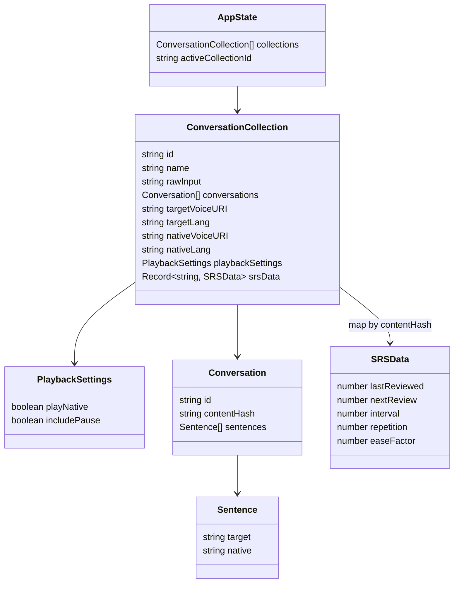

# Learn Foreign Language - Conversation Trainer

## Features

- **Conversation Editor**: Write conversations in a simple text format.
- **Parsing**: Automatically separates conversations by empty lines and translations by hyphens (`-`).
- **Collections**: Organize conversations into multiple collections.
- **Playback**: Listen to the target language pronunciation using browser text-to-speech.
- **Native Translation**: Toggle to play the native translation after each sentence.
- **Repetition Pause**: Toggle to include a pause matching the duration of the target speech for repetition.
- **Persistence**: Automatically saves your work to local storage.
- **Spaced Repetition (SRS)**: Tracks review times for each conversation to optimize recall.

## Data Structure



## Development

To run this project:

```bash
pnpm install
pnpm dev
```

## Planned Features

- Highlight sentence being played (Implemented)
- Playback from cursor position (Implemented)
- Visual indicator for SRS due date
